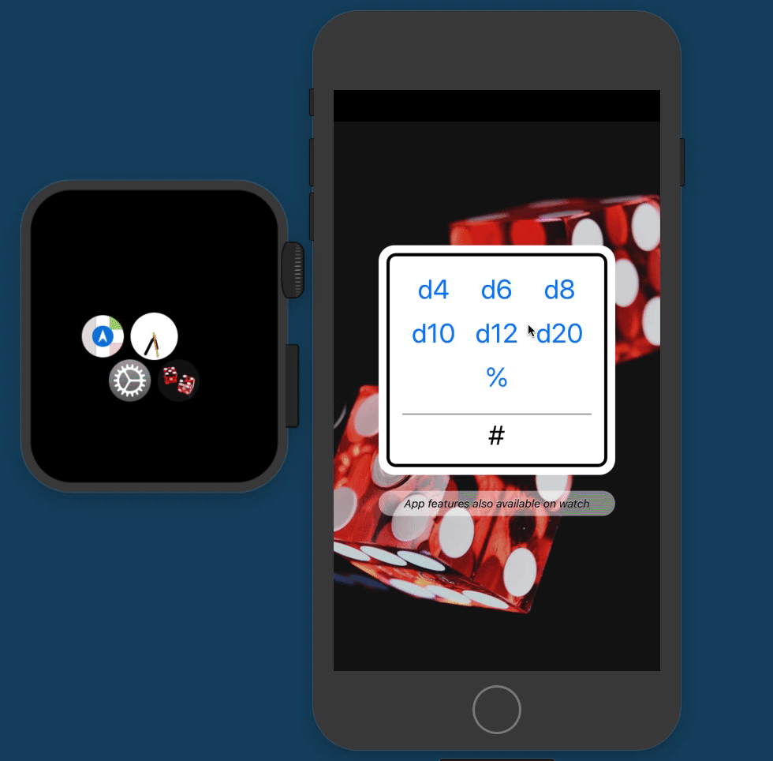

# Adventures in Watchmaking: Or Geek Wrists

This app emulates a set of the seven core D&D dice. 

*Simple project for developing an Apple Watch app and suitable for anyone's first project*

## Overview

This was an interesting dive into the WatchOS arena. This, along with an earlier effort intended to provide voice coaching for physical therapy, showed me exactly how limited the watch-side UIs and APIs are right now.

## Return to Sender

Consider the single call in the iOS app versus the seven in the watch app. WatchOS carries no concept of `sender` and cannot differentiate which button has been pushed except by calling signature.

```
// iOS
@IBAction func roll(_ button: UIButton) {
    let value = Int.random(in: 1 ... button.tag)
    let percent = button.tag == 100 ? "%" : ""
    label.text = "\(value)\(percent)"
}

// watchOS
@IBAction func d4()  { label.setText("\(Int.random(in: 1...4))")  }
@IBAction func d6()  { label.setText("\(Int.random(in: 1...6))")  }
@IBAction func d8()  { label.setText("\(Int.random(in: 1...8))")  }
@IBAction func d10() { label.setText("\(Int.random(in: 1...10))") }
@IBAction func d12() { label.setText("\(Int.random(in: 1...12))") }
@IBAction func d20() { label.setText("\(Int.random(in: 1...20))") }
@IBAction func dPercent() { label.setText("\(Int.random(in: 1...100))%") }
```

## Design and Coding

The project is stripped down to its core on both the iOS and watchOS extension sides.

The UI offers what can only be generously called an "Engineer-designed" interface on the iOS side. The UI is loud and undignified.) The watchOS side isn't lovely but it's livable, especially given its limited action scope.

Feel free to redesign this for me. I'd be happy for better design hints.

## Lessons on the WatchOS end

I learned about 

* Using buttons and learning about the `selector()` action pattern. My 7 callbacks should have been one.
* Customizing layout with groups and fixed sizes (no auto layout)
* Establishing text for a label (not through property assignment, but through a method call)

